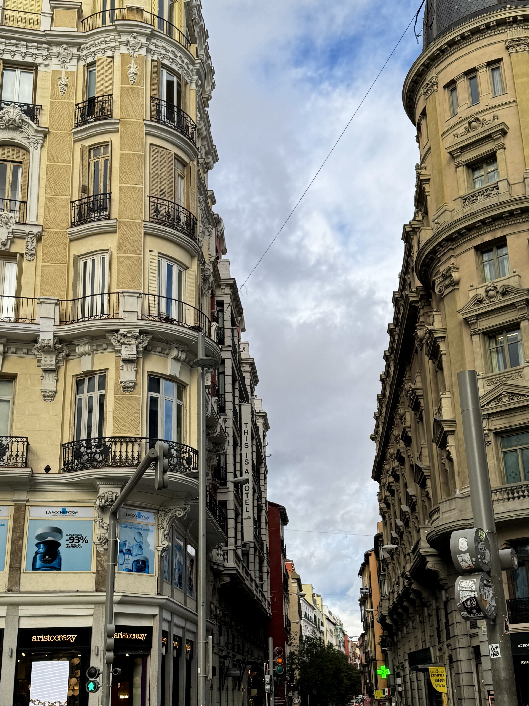
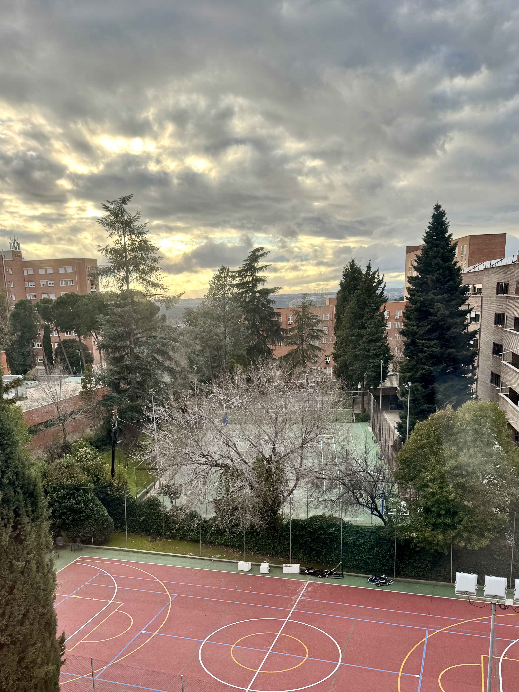
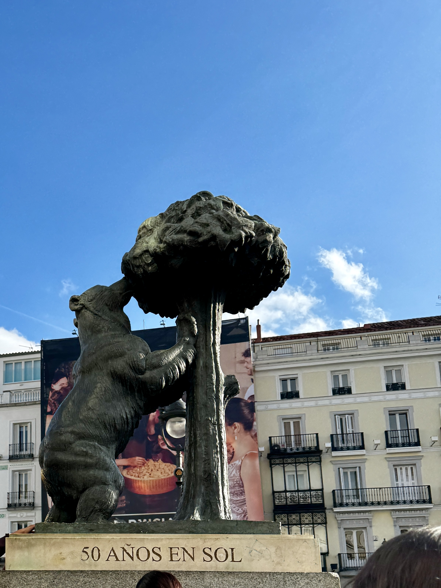
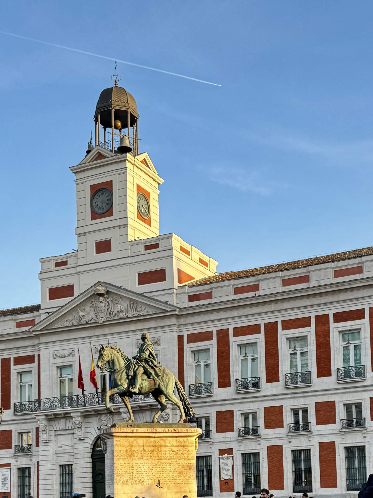

# Moments Abroad in Madrid, Spain 🫶🇪🇸

Catch flights, not feelings ✈️
A collection of moments that actually mean something—the streets that changed you, the light that got under your skin, the city that decided to keep you. Madrid, in all its messy, magnificent glory.

---

## Episode 1: City Skylines & Sacred Spaces

A thousand terracotta tiles catching the last of the sun—the whole city holding its breath before the lights come on, and you realize you're standing inside a postcard you'll never forget

The gates that separate ordinary from extraordinary—gold leaf and iron, built to make you feel small in the best way, like the world is so much bigger than you knew

White stone rising into a sky that doesn't know how to be anything but dramatic—the kind of view that makes you put your phone down and just stand there, stupid with wonder

Every balcony has held someone watching the street below—generations of lovers, dreamers, people who left and people who stayed—and now you're one of them

---

## Episode 2: Gothic Corners & Grand Museums

Rain on stone that's been here since before your country existed—the kind of doorway that makes you wonder what you'd believe in if you'd been born here, in the shadow of something this old

The street where Madrid refuses to sleep—where the crowd carries you forward and you stop being a tourist and start being part of the current, alive in a way that only happens when you're far from home

Don Quixote and Sancho watching over everyone who ever got a little too drunk on possibility—Spain's soul cast in bronze, still tilting at windmills after four hundred years

Where the light that fell on Goya and Velázquez falls on you too—art so heavy with history you can feel it in your chest, and the garden outside is where you go to remember how to breathe

---

## Episode 3: Blue Hour & Baroque Beauty

The moment the streetlights win and the pavement turns to liquid gold—when Madrid stops being a place you're visiting and becomes a place you're living inside, wet shoes and all

Frescoes that have watched a thousand sunsets—Plaza Mayor's jewel box, glowing like the city is holding up a lantern just for you, saying look, look what we built

Craning your neck until it hurts—Belle Époque giants stacked against a sky that's never quite dark, architecture so lavish it feels like the buildings are showing off for each other

The quiet that only exists in the shadow of something that mattered—stone that remembers what you don't, and the gift of standing still in a city that never stops moving

---

## Episode 4: Campus Walks & Twilight Moments

The path between who you were before you came and who you're becoming—pine needles underfoot, the campus holding space for the version of you that's still figuring it out

That electric blue when the world holds its breath—streetlights blinking on one by one, the neighborhood turning into a constellation, and you're standing in the middle of it, exactly where you're supposed to be

Three a.m. stacks and the smell of old paper—where you learn that knowledge is infinite and sleep is optional, and somewhere between the shelves you find out what you're capable of

Rain on the pergola and the kind of twilight that makes you want to write letters you'll never send—melancholy so beautiful it doesn't hurt, it just reminds you that you're alive

---

## Episode 5: Golden Hours & Medieval Magic

Madrid dissolving into honey—the light so thick you could drink it, the kind of golden hour that makes you believe in magic, or at least in the possibility of staying forever

Brick that's seen empires rise and fall—architecture that doesn't ask for your attention, it takes it, the kind of building that makes you stand up straighter without knowing why

A city that shouldn't exist, balanced on a hill like a dare—Toledo where the river bends and reality bends with it, and you're standing in the middle of a painting that refuses to stay flat

One step and you're four hundred years away—stone that remembers swords and sieges, light falling through the arch like it's been waiting for you, time travel without the machine

---

## Episode 6: Rooftops, Nights & Ancient Arches

The city on fire from above—rooftops catching the last of the sun, Madrid burning down in the best way, the kind of view that makes you understand why people write songs about places

Midnight and the neon is still singing—Gran Vía refusing to close its eyes, the street that taught you that some cities don't sleep because they're too busy being alive

The Madrid that doesn't make the postcards—courtyards where laundry hangs and neighbors know each other's names, the city when it's not performing, just existing, and letting you in on the secret

Stone that survived the war—the arch at Moncloa standing against a sky so clear it feels like a promise, history written in letters you can't read but can feel in your bones

---

## Episode 7: Puerta del Sol & the City That Believes in You

Looking up between buildings that have seen a million faces—the sky a gift at the end of the canyon, and you're standing in the narrowest part, exactly where the light gets through. You got this.

The bear and the strawberry tree—fifty years in Sol and still the heart of everything, the symbol that says this city belongs to the stubborn, the hungry, the ones who reach for what grows above them

Golden hour on the square where Spain begins—kings in bronze, clocks that have counted every important moment, and you in the middle of it, the moment you decided you weren't just passing through

Glass towers and old soul—the city reaching up to remind you that growth doesn't mean forgetting, that you can be ancient and new at once, that the sky is still the limit

---

## Locations Featured

Iglesia de San Jerónimo el Real ... Historic church near the Prado

Gran Vía ... Madrid's main shopping street

Plaza de España ... Iconic square with Cervantes monument

Museo del Prado ... World-renowned art museum

Palacio Real de Madrid ... The Royal Palace

Catedral de la Almudena ... Madrid's cathedral

Centro Histórico ... The charming historic center

Plaza Mayor ... Madrid's grand central square with stunning frescoes

Universidad Complutense de Madrid ... Faculty of Geography and History, campus life

Toledo ... Medieval hilltop city with river views and ancient fortresses

Plaza del Callao ... Rooftop views over central Madrid at sunset

Arco de la Victoria ... Triumphal arch at Moncloa with iconic bronze quadriga

Puerta del Sol ... The heart of Madrid, kilometer zero, where it all begins

El Oso y el Madroño ... The bear and strawberry tree, Madrid's beloved symbol

Real Casa de Correos ... Historic post office and clock tower, golden hour perfection

EY Tower & El Corte Inglés ... Modern skyline where the city reaches for the sky

---

Madrid, you have my heart. And my camera roll. And probably a piece of my soul I'm not getting back. Worth it. 💃🏻
