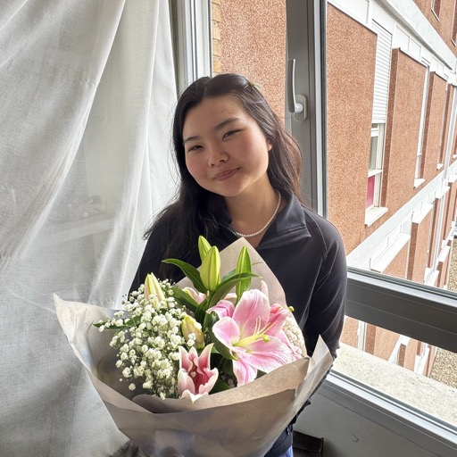

<!-- Tulip palette: #D4879C, #F2C4CE, #FAE8EC, #3D2B2B (matchaxmoxie). Hero image: j-adezhao/site/assets/images/avatar.jpg (synced from media/images/profile). -->

# Jade Zhao

### Informatics at Indiana University

*i think a lot about how things break. not in a pessimistic way - in a curious one. most problems are just unclear instructions in disguise.*

[Portfolio](https://matchaxmoxie.github.io/matchaxmoxie/) · [IU research site](https://jlzhao.pages.iu.edu/) · [Canva](https://jadexzhao.my.canva.site/) · [AI transparency](https://matchaxmoxie.github.io/matchaxmoxie/ai-transparency.html)

---

## Ratio et logos (What holds)

**IU Bloomington**, class of **2027** · **Business cognate: Business and Society**. I study how systems break and how to build them so they do not. **Precision in instructions** (for people and for machines) is how I treat responsibility when health, software, or institutions fail in the wild.

**Luddy Direct Admit** · **Hudson and Holland Scholar** (full-ride merit)

---

## Ordo (Year-by-year)

| Year | Span | One line |
|------|------|----------|
| [Freshman](https://matchaxmoxie.github.io/matchaxmoxie/freshman.html) | 2023 to 2024 | First real code. First community. ServeIT begins. |
| [Sophomore](https://matchaxmoxie.github.io/matchaxmoxie/sophomore.html) | 2024 to 2025 | Research deepened. Mentoring became a system. |
| [Junior](https://matchaxmoxie.github.io/matchaxmoxie/junior.html) | 2025 to 2026 | Madrid. Health informatics. High-stakes clarity. |
| [Senior](https://matchaxmoxie.github.io/matchaxmoxie/senior.html) | 2026 to 2027 | Capstone focus. Transfer quality. Leave it usable. |

Full year narrative: [matchaxmoxie](https://matchaxmoxie.github.io/matchaxmoxie/). Research files in this repo: [`research/README.md`](research/README.md).

---

## Opus selectum (Selected work)

- **[the madrid stress test](https://matchaxmoxie.github.io/matchaxmoxie/junior.html#piece-madrid-stress-test):** same method. completely different context. here's what held.
- **[the mentorship template](https://matchaxmoxie.github.io/matchaxmoxie/sophomore.html#piece-mentorship-template):** repeatable path from confused to clear.

---

## Theoria · Praxis

**PB sandwich:** systems do exactly what you say, in order, not what you meant. Same bar for AI prompts, CSS, feedback, handoffs. [Lesson on the site.](https://matchaxmoxie.github.io/matchaxmoxie/)

**ServeIT:** document early, test edges before handoff; grow from analyst work to feature-scale ownership (compliance, data, AI-assisted flows). *draft generation is AI-assisted. accountability is not.* [Transparency.](https://matchaxmoxie.github.io/matchaxmoxie/ai-transparency.html)

**Madrid** was a stress test: write assumptions, do not imply them. **FASE:** next step, test, adjust.

**Matcha Green Consulting:** **Software Engineer**, remote (**Jan--May 2026**); focus **GitHub Education** and **Cursor Enterprise**. **Clinic and OMSLD (MAP, Serve IT web lead):** see [résumé PDF](https://jlzhao.pages.iu.edu/resume.pdf) · TeX: [`resume/jade-zhao-resume-ats.tex`](resume/jade-zhao-resume-ats.tex) · [`matchaxmoxie/latex/docs/jade-zhao-resume.tex`](../matchaxmoxie/latex/docs/jade-zhao-resume.tex)

---

## Tech (snapshot)

Python, TypeScript, JavaScript, SQL, React, Node.js, PostgreSQL, Git; HIPAA-aware pipelines and governance; ethical AI, LLM orchestration, bias and oversight; WCAG-minded UX, Figma, mixed-methods research; Agile, technical writing. **Full skill lines:** [résumé PDF](https://jlzhao.pages.iu.edu/resume.pdf).

---

## Let's connect

*if you're building something carefully and want to think it through together - i'm here.*

| | |
|--|--|
| **Résumé** | [jlzhao.pages.iu.edu/resume.pdf](https://jlzhao.pages.iu.edu/resume.pdf) |
| **IU email** | [jlzhao@iu.edu](mailto:jlzhao@iu.edu) |
| **Personal** | [jadexzhao@outlook.com](mailto:jadexzhao@outlook.com) |
| **LinkedIn** | [linkedin.com/in/jadexzhao](https://www.linkedin.com/in/jadexzhao) |
| **GitHub** | [github.com/jazhao-ucm](https://github.com/jazhao-ucm) |
| **Instagram** | [instagram.com/j.adezhao](https://instagram.com/j.adezhao) |

**Open to full-time roles** after Spring **2027** · Bloomington, IN (open to relocation)

Optional snapshot (not HR-canonical): [`profile-summary.md`](profile-summary.md)

---

*ratio. logos. ordo. praxis.* 🌷

---

<strong>Repo</strong> (<code>j-adezhao/</code> in SP26; drop this block if you paste profile-only)

**Folder:** **`j-adezhao/`** in [SP26](https://github.com/jazhao-ucm/jazhao-ucm): **IU** edition of the [matchaxmoxie](https://matchaxmoxie.github.io/matchaxmoxie/) voice and arc, plus IU Pages (`site/`), research corpus, résumé TeX, lab. **jadexzhao** = public handle (Canva, LinkedIn, Instagram). **IU GitHub** (**github.iu.edu**) often holds this subtree; **jlzhao.pages.iu.edu** is updated by **manual upload**, not by `git push`.

**Gloss (*ratio. logos. ordo. praxis.*):** **ratio** (Latin), rationale that holds the work together; **logos** (Greek), saying it clearly so others can rely on it; **ordo** (Latin), order and sequence (for example the year-by-year arc); **praxis** (Greek), what you ship and how you act.

| Doc | Use |
|-----|-----|
| [**WORKSPACE.md**](WORKSPACE.md) | Map, hosting (IU + GitHub Pages), commands |
| [**config/README.md**](config/README.md) | **GitHub universal** static URLs, **`site.json`** |
| [**research/README.md**](research/README.md) | Research arc |
| [**planning/senior-year-2026-27.md**](planning/senior-year-2026-27.md) | Senior checklist |
| [**lab/README.md**](lab/README.md) | Notebooks and simulations |
| [**profile-summary.md**](profile-summary.md) | Archived LinkedIn-style export |
| [**docs/employment/README.md**](docs/employment/README.md) | IU position descriptions (e.g. FASE MAP Coordinator PDF) |

UCM (Madrid) courses: sibling folders · calendar [`docs/INDEX.md`](../docs/INDEX.md)

