# Moments Abroad in Madrid, Spain

Catch flights, not feelings ✈️ \
A visual notebook of Madrid's streets, landmarks, and everyday corners.

**How this is labeled:** Each photo uses plain **alt text** (what’s in the frame, for accessibility and broken images). The **line under** is the display caption—short, same voice throughout, not a second description.

---

## Episode 1: City Skylines & Sacred Spaces

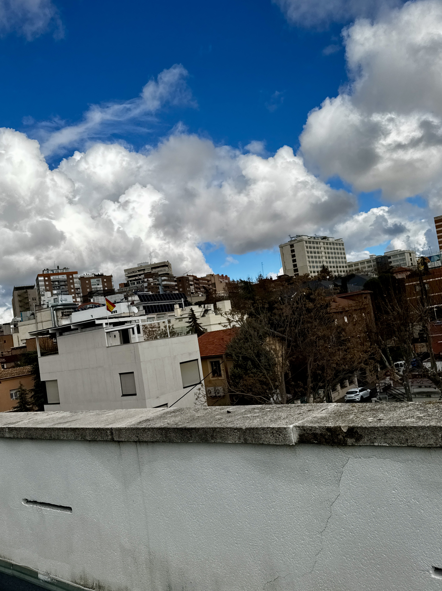
First day in Madrid. Looked up a lot.

The view from somewhere over the city.

The Royal Palace gates, reflected in a puddle.

Almudena Cathedral on a cloudy afternoon.

---

## Episode 2: Gothic Corners & Grand Museums

Iglesia de San Jerónimo el Real in the rain.

Gran Vía on a busy afternoon.

Plaza de España, quieter than expected.

The Prado. One of those places you have to see.

---

## Episode 3: Blue Hour & Baroque Beauty

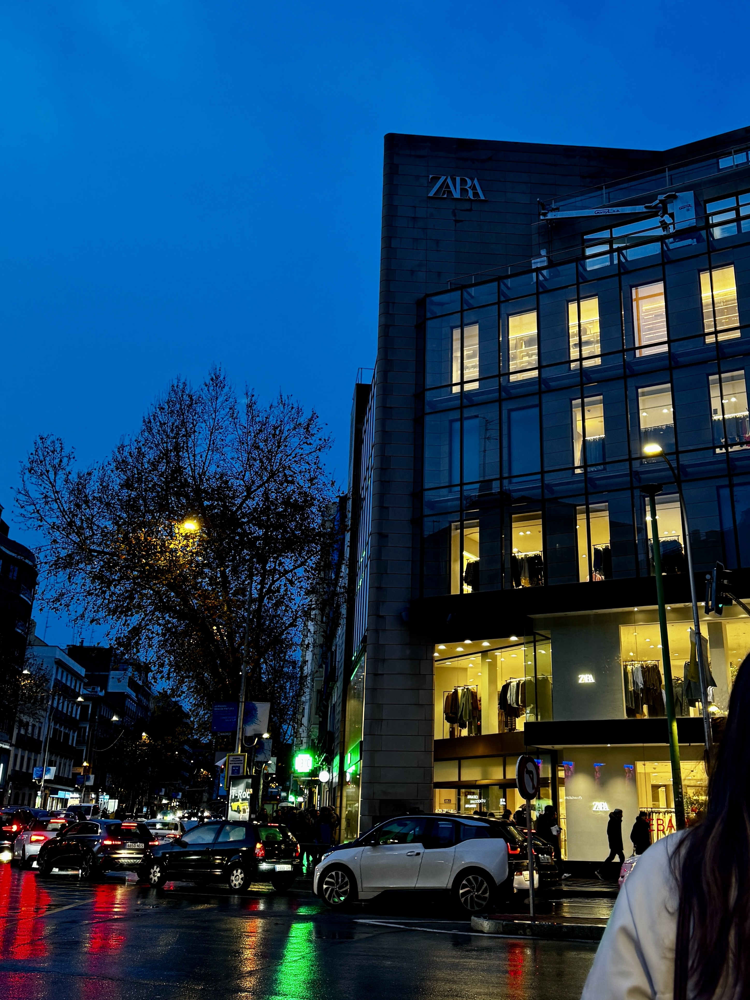
Zara on Gran Vía after dark.

Plaza Mayor catching the last of the light.

Looking up on Gran Vía.

A quiet corner of the old city.

---

## Episode 4: Campus Walks & Twilight Moments

The long way round campus.

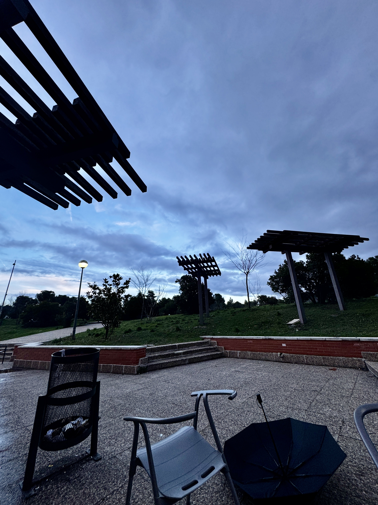
Blue hour on the way home.

Quiet floor, finally.

End of the day, end of the rain.

---

## Episode 5: Golden Hours & Medieval Magic

Madrid at golden hour.

Spotted from the bus window.

The whole city on a hill.

The entrance to Toledo.

---

## Episode 6: Rooftops, Nights & Ancient Arches

Rooftop above Callao. Worth the stairs.

Same street as daytime, different personality.

Ordinary Tuesday view from the neighborhood. I like the grey days too.

Arco de la Victoria, clear sky. Moncloa always feels like a threshold.

---

## Episode 7: Puerta del Sol & the City That Believes in You

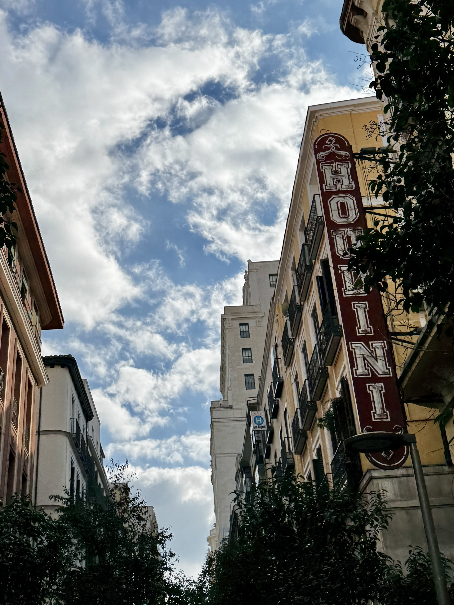
Looking up somewhere near Sol.

The bear and the tree. 50 years at Sol.

Puerta del Sol at golden hour.

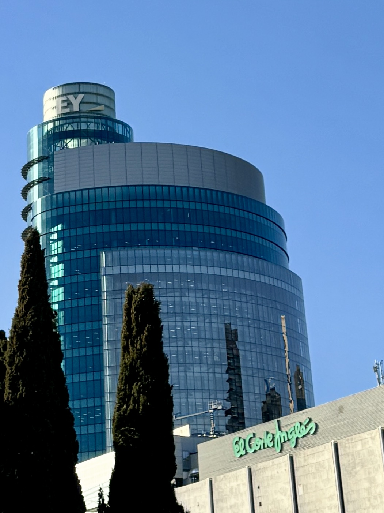
Old city, new skyline.

---

## Episode 8: Nights Out & Hidden Gems

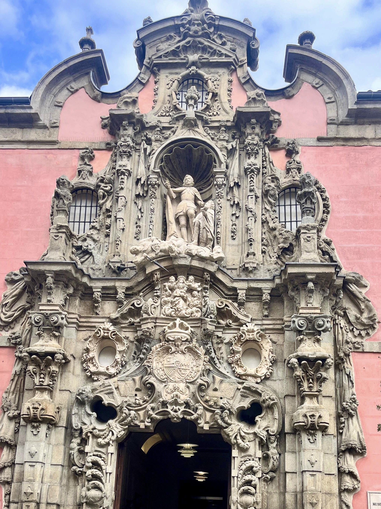
Gran Vía 84 at night. All marble and gold.

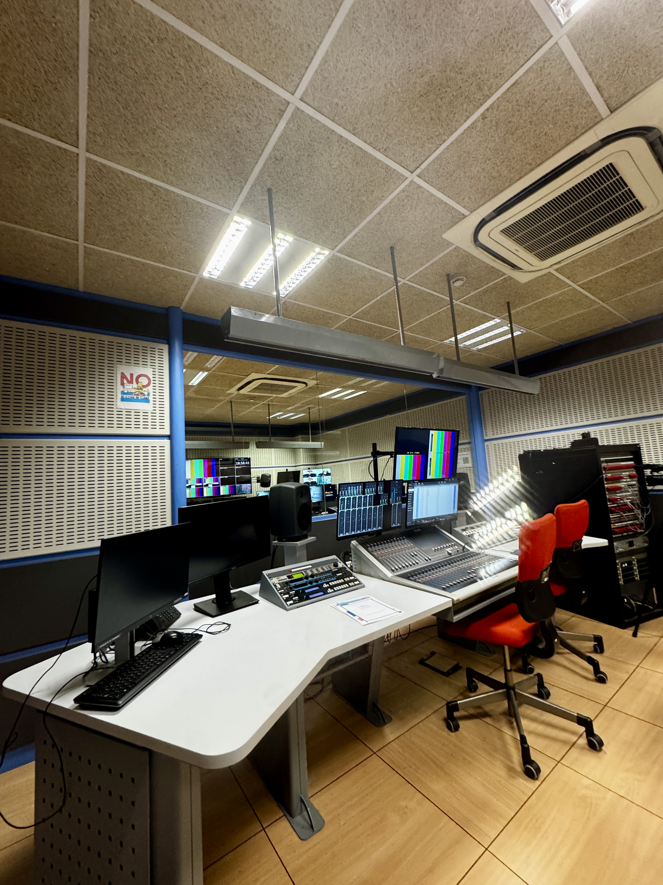
Ale-Hop doing the most with a ferris wheel window display.

Behind the scenes at a broadcast studio.

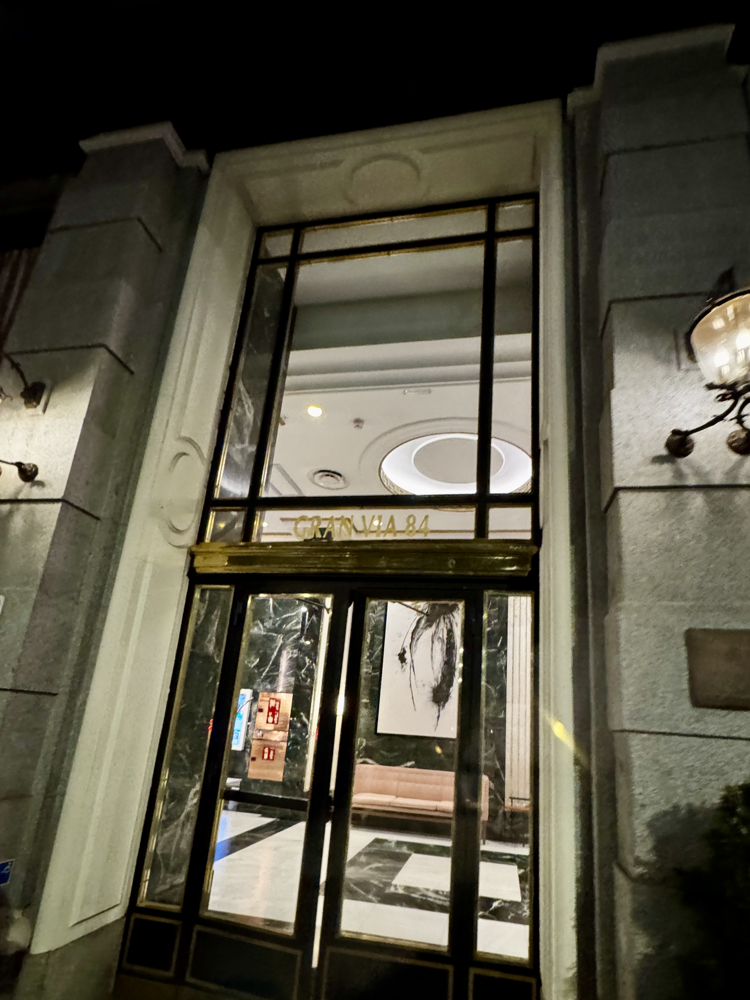
The Museo de Historia de Madrid portal is genuinely one of the most detailed things I have ever seen.

---

## Episode 9: Buen Día & Bites Around the City

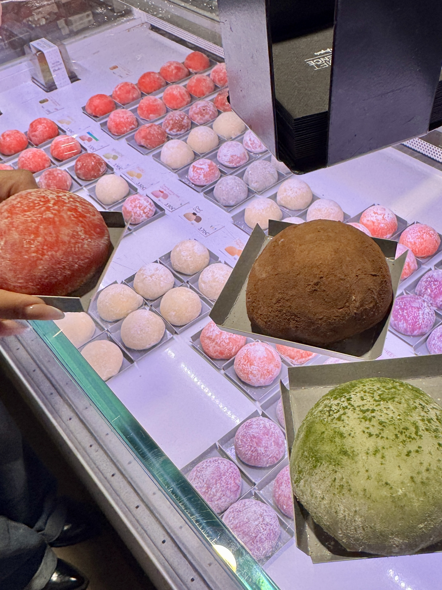
Buen día, indeed.

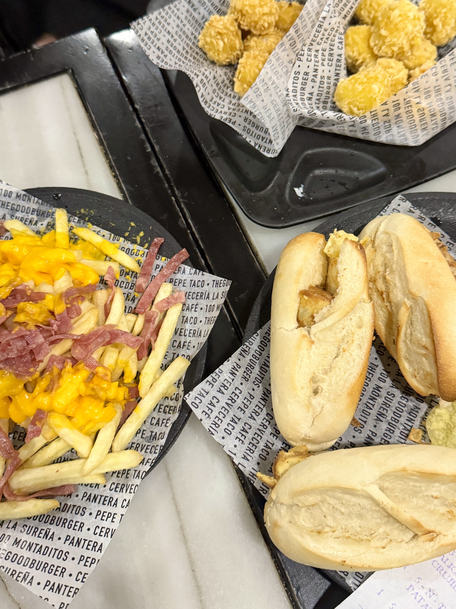
Crêpes with salsa and avocado on Fuencarral. Solid lunch.

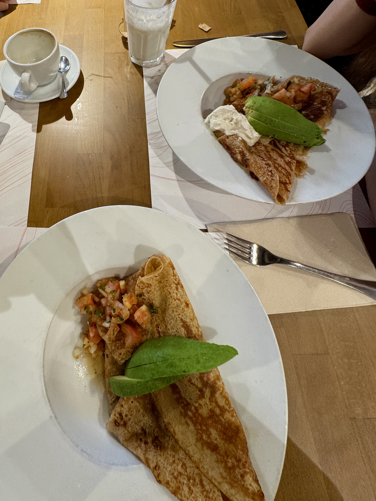
100 Montaditos order. No notes.

The mochi selection had no bad options.

---

## Episode 10: Segovia — Roman Stone, Stained Glass & Gothic Spires

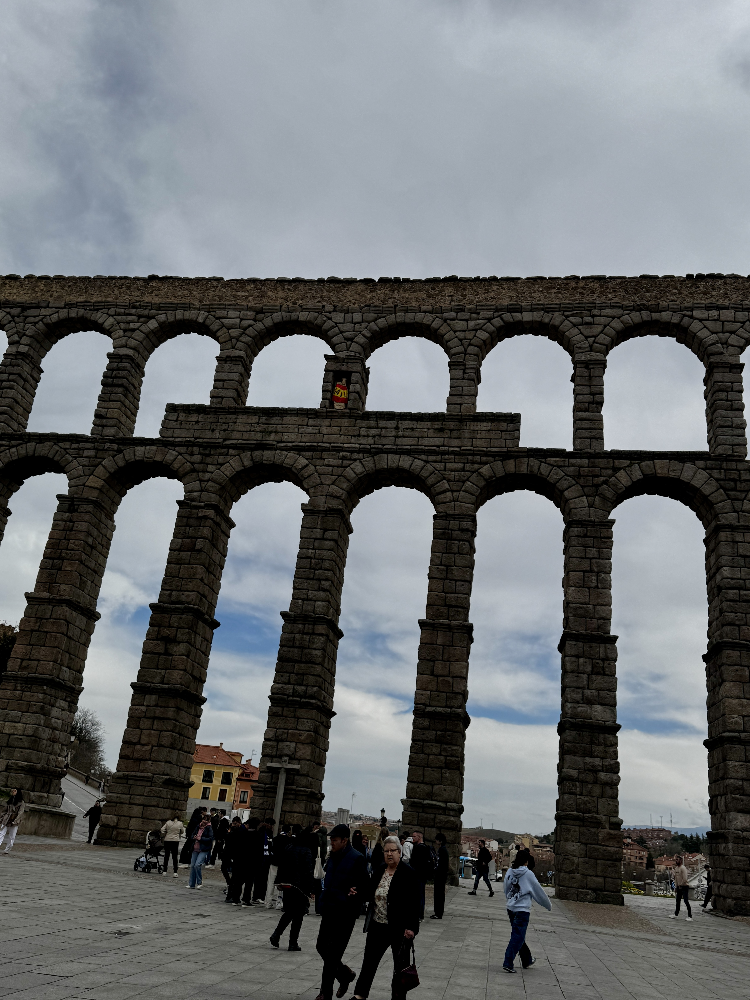
Two thousand years and not a single nail.

Segovia Cathedral doing what it does best.

The view from the top was worth it.

500 years old and still stunning.

---

## Episode 11: Matcha, Lattes & Quiet Café Corners

Matcha in Spain, don't mind if I do.

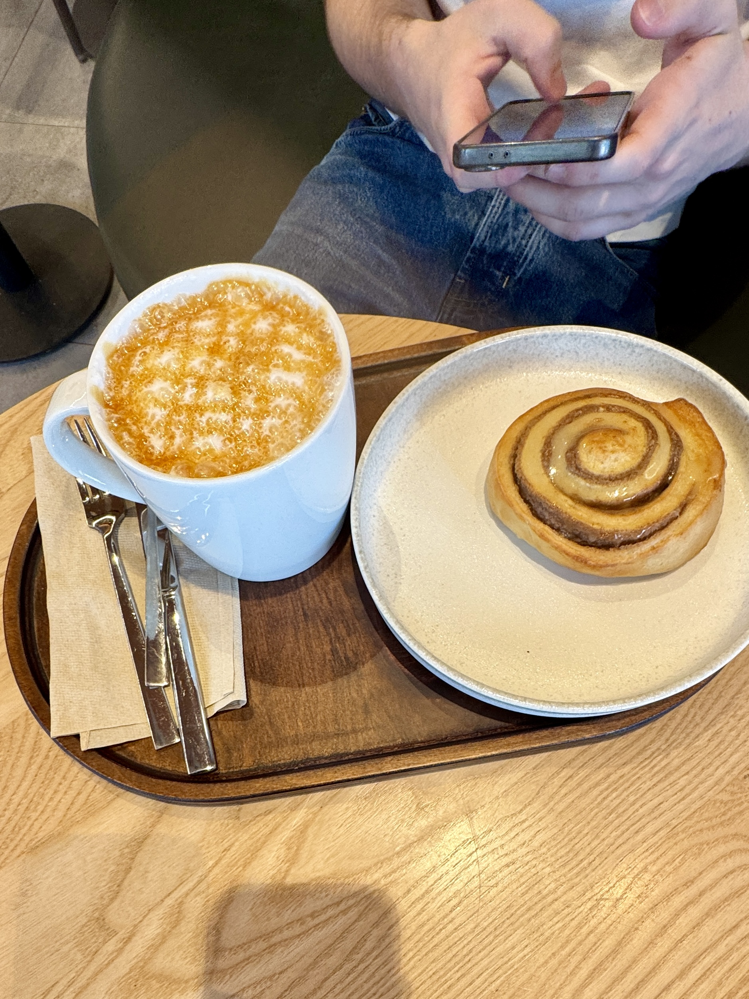
Cinnamon roll season, always.

Too pretty to stir.

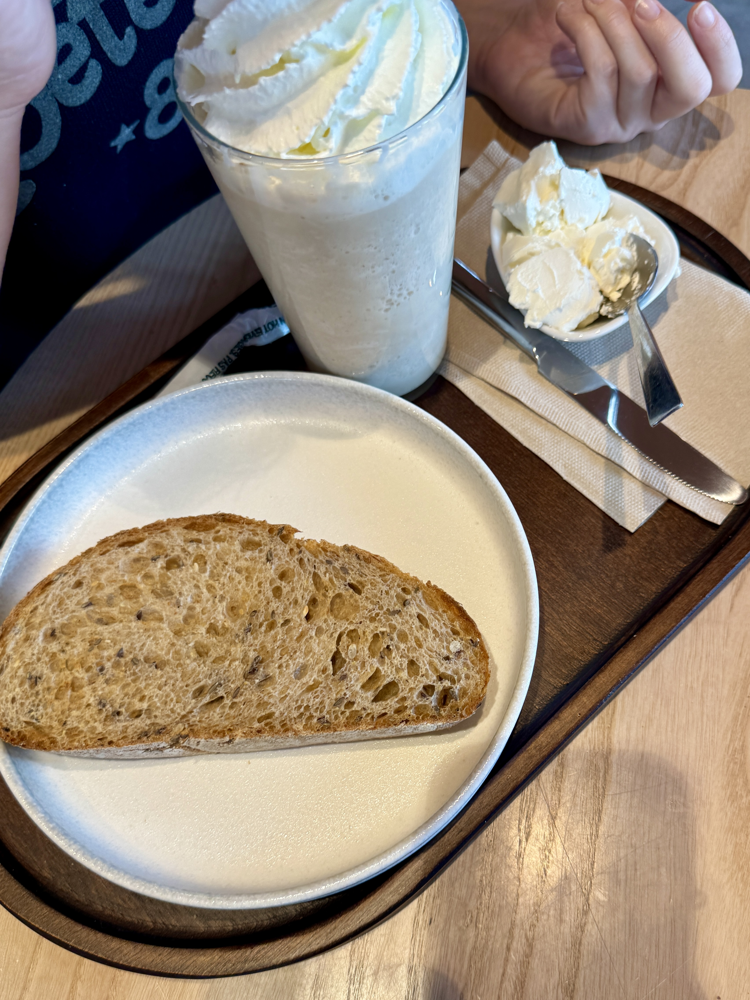
Fuelled up and ready.

---

## Locations Featured

Iglesia de San Jerónimo el Real · Historic church near the Prado \
Gran Vía · Madrid's main shopping and entertainment avenue \
Plaza de España · Iconic square with the Cervantes monument \
Museo del Prado · World-renowned art museum \
Palacio Real de Madrid · The Royal Palace \
Catedral de la Almudena · Madrid's cathedral \
Centro Histórico · The historic city center \
Plaza Mayor · Central square with painted façades and arcades \
Universidad Complutense de Madrid · Campus and surrounding parks \
Toledo · Medieval hilltop city with river views and fortifications \
Plaza del Callao · Rooftop views over central Madrid at sunset \
Arco de la Victoria · Triumphal arch at Moncloa with bronze quadriga \
Puerta del Sol · Kilometer zero and one of Madrid's main squares \
El Oso y el Madroño · Bear and strawberry tree statue, symbol of the city \
Real Casa de Correos · Historic post office and clock tower in Puerta del Sol \
EY Tower & El Corte Inglés · Landmarks of Madrid's modern business district \
Mercado de San Miguel · Historic iron market near Plaza Mayor \
La Latina · Bohemian neighborhood, home to El Rastro Sunday flea market \
Parque del Retiro · Madrid's beloved central park and green lung \
Palacio de Cristal · Glass and iron palace within Retiro Park \
Jardines de Sabatini · Formal gardens bordering the Royal Palace \
Templo de Debod · Ancient Egyptian temple gifted to Spain, iconic sunset spot \
Calle de Fuencarral · Trendy shopping street in Malasaña and Chueca, lined with independent shops, bakeries, and creperies \
Segovia · Roman aqueduct, Alcázar, and Gothic cathedral on a hill-town day trip from Madrid \
Acueducto de Segovia · Two-tier Roman granite bridge, emblem of the city \
Alcázar de Segovia · Fortress-palace with royal stained glass and tower views \
Catedral de Segovia · Late Gothic “Lady of Cathedrals” with dome and pinnacles \
Starbucks (Madrid) · Study-session fuel—matcha, layered drinks, and café corners between classes \
Adolfo Suárez Madrid-Barajas Airport · Gateway in and out of the city

---

## A Note from the Photographer

Madrid doesn't just welcome you ... it absorbs you. It gets into the rhythm of your mornings, the route of your evening walks, the way you start saying *venga* at the end of every sentence without noticing. Every episode in this notebook is a small proof of that: that a city can feel like yours even when you're only borrowing it for a season.

If you ever find yourself with a one-way ticket and a half-charged camera, point it at Madrid. It will give you something worth keeping.

---

Madrid, you have my heart. 💃🏻

## Aesthetica Bilinguis (Greco-Latin + English Pattern)

- Titling follows a Greco-Latin plus English pairing where useful, for example `Theoria (Learning)`.
- Style favors precise structure, consistent labels, and plain punctuation.
- Documentation edits preserve source meaning and prioritize clarity over decoration.

## SEO et Textus Alternus (SEO and Alt Text Standard)

- Markdown image entries use explicit, descriptive alt text that states what is visible in the frame.
- Captions stay concise and distinct from alt text so accessibility and display copy serve different roles.
- HTML-adjacent docs keep canonical metadata and social preview alt-text conventions aligned with site standards.
